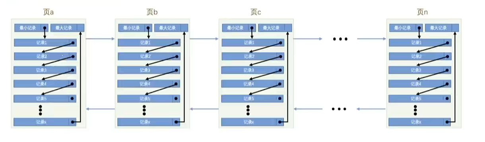
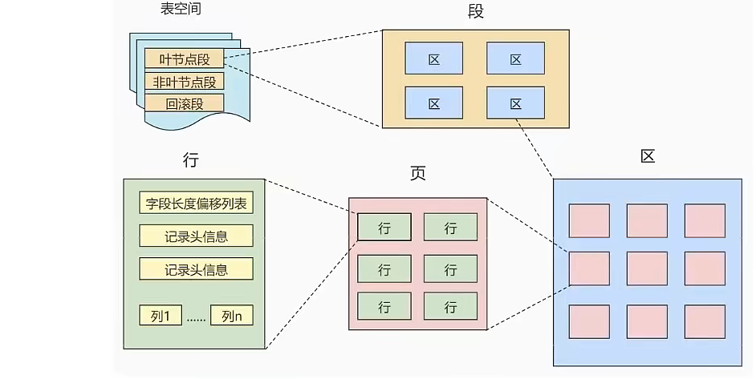
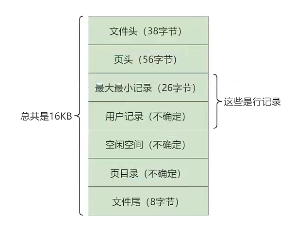
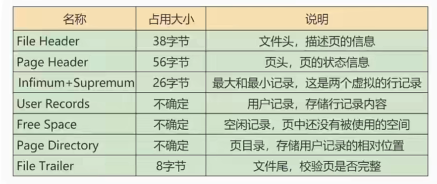

# InnoDB数据存储结构


## 1、数据库的存储结构：页

索引结构给我们提供了高效的索引方式，不过索引信息以及数据记录都是保存在文件上的，确切说是存储在页结构中。另一方面,索引是在存储引擎中实现的，MySQL服务器上的==存储引擎==负责对表中数据的读取和写入工作。不同存储引擎中==存放的格式==一般是不同的， 甚至有的存储引擎比如Memory都不用磁盘来存储数据。

由于==InnoDB==是MyISQL的==默认存储引擎==，所以本章剖析InnoDB存储弓|擎的数据存储结构。

### 1.1磁盘与内存交互基本单位：页

InnoDB将数据划分为若千个页，InnoDB中页的大小默认为==16KB==。

以==页==作为磁盘和内存之间交互的==基本单位==，也就是一次最少从磁盘中读取16KB的内容到内存中，一次最少把内存中的16KB内容刷新到磁盘中。也就是说，==在数据库中,不论读一行，还是读多行，都是将这些行所在的页进行加载。也就是说，数据库管理存储空间的基本单位是页(Page) ,数据库I/O操作的最小单位是页。一个页中可
以存储多个行记录==。

> 记录是按照行来存储的，但是数据库的读取并不以行为单位，否则一次读取(也就是一次 I/O操作)只能处理一行数据，效率会非常低。

### 1.2页结构概述



页a、页b、页c ..页n这些页可以==不在物理结构上相连==，只要通过==双向链表==相关联即可。每个数据页中的记录会按照主键值从小到大的顺组成一个==单向链表==，每个数据页都会为存储在它里边的记录生成一个页目录，在通过主键查找某条记录的时候可以在页目录中使用==二分法==快速定位到对应的槽,然后再遍历该槽对应分组中的记录即可快速找到指定的记录。

### 1.3页的大小

不同的数据库管理系统(简称DBMS )的页大小不同。比如在MySQL的InnoDB存储弓|擎中，默认页的大小是==16KB==，我们可以通过下面的命令来进行查看:

```mysql
SHOW VARIABLES LIKE '%innodb_page_size%';
```

### 1.4页的上层结构



==区(Extent)== 是比页大一级的存储结构，在InnoDB存储引擎中，一个区会分配==64个连续的页==。因为InnoDB中的页大小默认是16KB，所以一个区的大小是64*16KB= 1MB。

==段(Segment)== 由一个或多个区组成，区在文件系统是一个连续分配的空间(在InnoDB中是连续的64个页)，不过在段中不要求区与区之间是相邻的。==段是数据库中的分配单位 ，不同类型的数据库对象以不同的段形式存在==。当我们创建数据表、索引的时候，就会相应创建对应的段，比如创建一张表时会创建一个表段， 创建一个索弓时会创建一个索引段。

==表空间(Tablespace)== 是一个逻辑容器,表空间存储的对象是段，==在一个表空间中可以有一个或多个段,但是一个段只能属于一个表空间。==数据库由一个或多个表空间组成，表空间从管理上可以划分为==系统表空间、用户表空间、撤销表空间、临时表空间等。==


## 2、页的内部结构

页如果按类型划分的话，常见的有==数据页(保存B+树节点)、系统页、 Undo 页和事务数据页==等。数据页是我们最常使用的页。数据页的16KB大小的存储空间被划分为七个部分，分别是文件头(File Header)、页头(Page Header)、最大最小记录(Infimum+supremum) 、用户记录(User Records)、空闲空间(Free Space)、页目录(PageDirectory)和文件尾(File Tailer)。

页结构的示意图如下所示:



这7个部分作用分别如下，我们简单梳理如下表所示: 



​	我们可以把七个结构分成三个部分：

第一部分：File Header和File Trailer