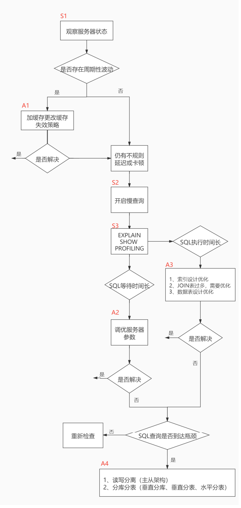
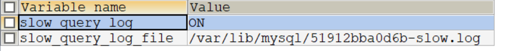
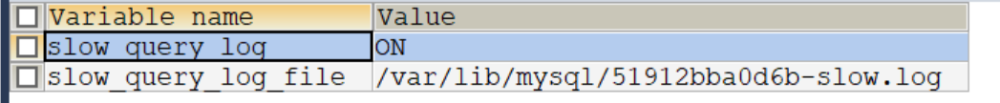
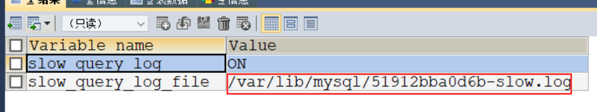
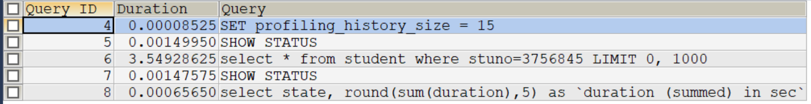
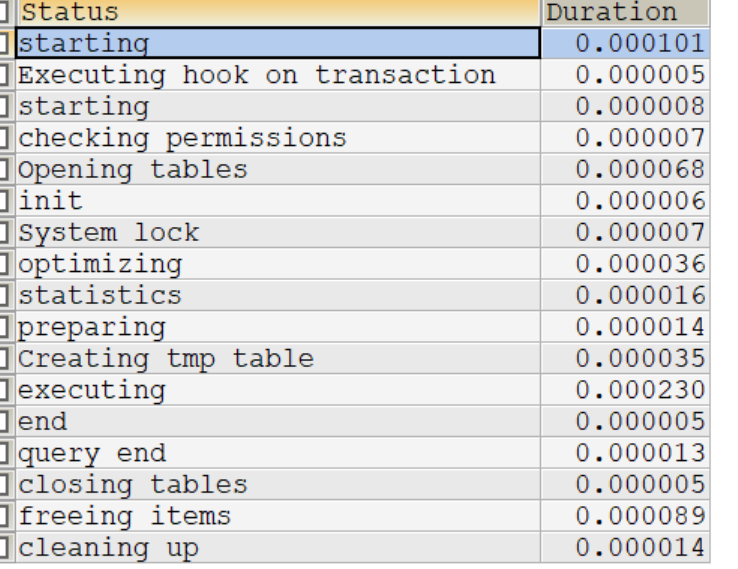
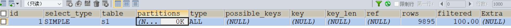
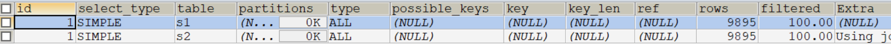

## 性能分析工具的使用

在数据库调优中，我们的目标就是==响应时间更快、吞吐量更大==。利用宏观的监控工具和微观的日志分析可以帮我们快速找到调优的思路和方式

## 1、数据库服务器的优化步骤

当我们遇到数据库调优问题的时候，该如何思考呢？这里把思考的流程整理成下面这张图。 整个流程划分成了 ==观察（Show status）== 和== 行动（Action）== 两个部分。字母 S 的部分代表观察（会使 用相应的分析工具），字母 A 代表的部分是行动（对应分析可以采取的行动）




## 2.查看系统性能参数

在MySQL中，可以使用 ==SHOW STATUS== 语句查询一些MySQL数据库服务器的==性能参数== 、 ==执行频率== 。

 SHOW STATUS语句语法如下：

```mysql
SHOW [GLOBAL|SESSION] STATUS LIKE '参数'
```


一些常用的性能参数如下：

+ Connections：连接MySQL服务器的次数。

+ Uptime：MySQL服务器的上 线时间。 

+ Slow_queries：慢查询的次数。

+ Innodb_rows_read：Select查询返回的行数 

+ Innodb_rows_inserted：执行INSERT操作插入的行数 

+ Innodb_rows_updated：执行UPDATE操作更新的 行数 

+ Innodb_rows_deleted：执行DELETE操作删除的行数 

+ Com_select：查询操作的次数。 

+ Com_insert：插入操作的次数。对于批量插入的 INSERT 操作，只累加一次。

+ Com_update：更新操作 的次数。

+ Com_delete：删除操作的次数。

	

## 3.统计SQL的查询成本：last_query_cost

举例一、

```mysql
SELECT student_id, class_id, NAME, create_time FROM student_info
WHERE id = 900001;  # 运行时间 0.014

SHOW STATUS LIKE 'last_query_cost';

#然后再看下查询优化器的成本，实际上我们只需要检索一个数据页即可：
+-----------------+----------+
| Variable_name | Value |
+-----------------+----------+
| Last_query_cost | 1.000000 |
+-----------------+----------+
```


举例二、

```mysql
SELECT student_id, class_id, NAME, create_time FROM student_info
WHERE id BETWEEN 900001 AND 900100;#运行时间 0.014

SHOW STATUS LIKE 'last_query_cost';


+-----------------+-----------+
| Variable_name | Value |
+-----------------+-----------+
| Last_query_cost | 20.290751 |
+-----------------+-----------+

```


你能看到页的数量是刚才的 20 倍，但是查询的效率并没有明显的变化，实际上这两个 SQL 查询的时间 基本上一样，就是因为采用了顺序读取的方式将页面一次性加载到缓冲池中，然后再进行查找。虽然==页数量（last_query_cost）增加了不少==，但是通过缓冲池的机制，并==没有增加多少查询时间==。

**使用场景**：对比开销，特别是我们有好几种查询方式的时候


## 4、定位执行慢的 SQL：慢查询日志

MySQL的慢查询日志，用来记录在MySQL中==响应时间超过阀值的语句==，具体指运行时间超过==long_ query_time==值的SQL，则会被记录到慢查询日志中。long_ query_ time的默认值为==10==，意思是运行10秒以上(不含10秒)的语句，认为是超出了我们的最大忍耐时间值。

它的主要作用是，帮助我们发现那些执行时间特别长的SQL查询，并且有针对性地进行优化，从而提高系统的整体效率。当我们的数据库服务器发生阻塞、运行变慢的时候，检查一下慢查询日志， 找到那些慢查询,对解决问题很有帮助。比如一条sq执行超过5秒钟,我们就算慢SQL，希望能收集超过5秒的sql, 结合explain进行全面分析。

默认情况下，MySQL数据库==没有开启慢查询日志==，需要我们手动来设置这个参数。==如果不是调优需要的话，一般不建议启动该参数==，因为开启慢查询日志会或多或少带来-定的性能影响。
慢查询日志支持将日志记录写入文件。

### 4.1 开启慢查询日志参数

#### 1.开启slow_query_log

```mysql
set global slow_query_log='ON';
```

然后我们再来查看下慢查询日志是否开启，以及慢查询日志文件的位置：

```mysql
SHOW VARIABLES LIKE '%slow_query_log%'
```



#### 2.修改long_query_time阈值

```mysql
show variables like '%long_query_time%';
```

这里如果我们想把时间缩短，比如设置为 1 秒，可以这样设置：

```mysql
#测试发现：设置global的方式对当前session的long_query_time失效。对新连接的客户端有效。所以可以一并
执行下述语句
set global long_query_time = 1;
show global variables like '%long_query_time%';
set long_query_time=1;
show variables like '%long_query_time%';
```


**补充：配置文件中一并设置参数**

永久设置方式：

修改my.cnf，[mysqId]下增加或修改参数long_query_time、slow_query_log和slow_query_log_file后，重启mysql服务器。

```mysql
[mysqlId]
slow_query_log=ON #开启慢查询开关
slow_query_log_file=/var/lib/mysql/slow.log #慢查询文件目录
long_query_time=1 #慢查询阈值
log_output=FILE
```

### 4.2查看慢查询数目

```mysql
SHOW GLOBAL STATUS LIKE '%slow_queries%'
```


举例一

1、

```mysql
CREATE TABLE `student` (
`id` INT(11) NOT NULL AUTO_INCREMENT,
`stuno` INT NOT NULL ,
`name` VARCHAR(20) DEFAULT NULL,
`age` INT(3) DEFAULT NULL,
`classId` INT(11) DEFAULT NULL,
PRIMARY KEY (`id`)
) ENGINE=INNODB AUTO_INCREMENT=1 DEFAULT CHARSET=utf8;
```

2、创建函数，假如报错：

```mysql
This function has none of DETERMINISTIC......
```

命令开启：允许创建函数设置：

```mysql
set global log_bin_trust_function_creators=1; # 不加global只是当前窗口有效。
```

3、随机产生字符串：

```mysql
DELIMITER //
CREATE FUNCTION rand_string(n INT)
RETURNS VARCHAR(255) #该函数会返回一个字符串
BEGIN
DECLARE chars_str VARCHAR(100) DEFAULT
'abcdefghijklmnopqrstuvwxyzABCDEFJHIJKLMNOPQRSTUVWXYZ';
DECLARE return_str VARCHAR(255) DEFAULT '';
DECLARE i INT DEFAULT 0;
WHILE i < n DO
SET return_str =CONCAT(return_str,SUBSTRING(chars_str,FLOOR(1+RAND()*52),1));
SET i = i + 1;
END WHILE;
RETURN return_str;
END //
DELIMITER ;
#测试
SELECT rand_string(10);
```

4、产生随机数值：

```mysql
DELIMITER //
CREATE FUNCTION rand_num (from_num INT ,to_num INT) RETURNS INT(11)
BEGIN
DECLARE i INT DEFAULT 0;
SET i = FLOOR(from_num +RAND()*(to_num - from_num+1)) ;
RETURN i;
END //
DELIMITER ;
#测试：
SELECT rand_num(10,100);
```

5、创建存储过程

```mysql
DELIMITER //
CREATE PROCEDURE insert_stu1( START INT , max_num INT )
BEGIN
DECLARE i INT DEFAULT 0;
SET autocommit = 0; #设置手动提交事务
REPEAT #循环
SET i = i + 1; #赋值
INSERT INTO student (stuno, NAME ,age ,classId ) VALUES
((START+i),rand_string(6),rand_num(10,100),rand_num(10,1000));
UNTIL i = max_num
END REPEAT;
COMMIT; #提交事务
END //
DELIMITER ;
```

6、调用存储过程

```mysql
#调用刚刚写好的函数, 4000000条记录,从100001号开始
CALL insert_stu1(100001,4000000);
```

7、测试

```mysql
SELECT * FROM student WHERE stuno=3756845;#1.070

SELECT * FROM student WHERE NAME='qduLvU';#1.159
```

慢查询情况

```mysql
SHOW STATUS LIKE 'slow_queries';
```


### 4.3慢查询日志分析工具：mysqldumpslow

mysqldumpslow 命令的具体参数如下：

+ -a: 不将数字抽象成N，字符串抽象成S
+  -s: 是表示按照何种方式排序：
	+  c: 访问次数 
	+ l: 锁定时间 
	+ r: 返回记录 
	+ t: 查询时间 
	+ al:平均锁定时间 
	+ ar:平均返回记录数 
	+ at:平均查询时间 （默认方式） 
	+ ac:平均查询次数 
+ -t: 即为返回前面多少条的数据；
+ -g: 后边搭配一个正则匹配模式，大小写不敏感的；

#### 1、举例

先查出慢查询日志文件的存放目录：

```mysql
SHOW VARIABLES LIKE '%slow_query_log%'
```



我们想要按照查询时间排序，查看前五条 SQL 语句，这样写即可：

```mysql
mysqldumpslow -s t -t 5 /var/lib/mysql/51912bba0d6b-slow.log
```

**工作常用参考：**

```mysql
#得到返回记录集最多的10个SQL
mysqldumpslow -s r -t 10 /var/lib/mysql/51912bba0d6b-slow.log
#得到访问次数最多的10个SQL
mysqldumpslow -s c -t 10 /var/lib/mysql/51912bba0d6b-slow.log
#得到按照时间排序的前10条里面含有左连接的查询语句
mysqldumpslow -s t -t 10 -g "left join" /var/lib/mysql/51912bba0d6b-slow.log
#另外建议在使用这些命令时结合 | 和more 使用 ，否则有可能出现爆屏情况
mysqldumpslow -s r -t 10 /var/lib/mysql/51912bba0d6b-slow.log | more

```

### 4.4关闭慢查询日志

**方式1：永久性方式**

```mysql
[mysqld]
slow_query_log=OFF
#或者，把slow_query_log一项注释掉 或 删除
[mysqld]
#slow_query_log =OFF
```

重启MySQL服务，执行如下语句查询慢日志功能。

```mysql
SHOW VARIABLES LIKE '%slow%'; #查询慢查询日志所在目录
SHOW VARIABLES LIKE '%long_query_time%'; #查询超时时长
```

**方式2：临时性方式**

使用SET语句来设置。 （1）停止MySQL慢查询日志功能，具体SQL语句如下。

```mysql
SET GLOBAL slow_query_log=off;
```

重启MySQL服务，执行如下语句查询慢日志功能。

```mysql
SHOW VARIABLES LIKE '%slow%'; #查询慢查询日志所在目录
SHOW VARIABLES LIKE '%long_query_time%'; #查询超时时长
```

### 4.5删除慢查询日志文件

删除下面文件即可

```mysql
SHOW VARIABLES LIKE '%slow_query_log%'
```



### 4.6重新恢复慢查询日志文件

```mysql
mysqladmin flush-logs slow
```

一旦执行了这个命令，慢查询日志都只存在新的日志文件中，如果需要旧的日志文件，就得事先备份。

## 5.查看 SQL 执行成本：SHOW PROFILE

开启

```mysql
show variables like 'profiling';
set profiling = 'ON';
```

举例

```mysql
SELECT * FROM student WHERE stuno=3756845;#1.070

SELECT * FROM student WHERE NAME='qduLvU';#1.159
```

执行完查询

```mysq
 show profiles;
```



如果只想看最近一次查询的开销可以使用

```mysql
show profile;
```



如果想指定某次查询 需要使用 SHOW PROFILES; 结果的query_id

```my
 show profile cpu,block io for query 6;
```

**show profile的常用查询参数：**

 ① ALL：显示所有的开销信息。 ② BLOCK IO：显示块IO开销。 ③ CONTEXT SWITCHES：上下文切换开 销。 ④ CPU：显示CPU开销信息。 ⑤ IPC：显示发送和接收开销信息。 ⑥ MEMORY：显示内存开销信 息。 ⑦ PAGE FAULTS：显示页面错误开销信息。 ⑧ SOURCE：显示和Source_function，Source_file， Source_line相关的开销信息。 ⑨ SWAPS：显示交换次数开销信息。


## 6.分析查询语句：EXPLAIN

### 6.1概述

==定位了查询慢的SQL之后，我们就可以使用EXPLAIN或DESCRIBE工具做针对性的分析查询语句==。DESCRIBE语句的使用方法与EXPLAIN语句是一样的，并且分析结果也是一样的。

MySQL中有专门]负责优化SELECT语句的优化器模块，主要功能:通过计算分析系统中收集到的统计信息，为客户端请求的Query提供它认为最优的==执行计划==(他认为最优的数据检索方式， 但不见得是DBA认为是最优的，这部分最耗费时间)。

这个执行计划展示了接下来具体执行查询的方式，比如多表连接的顺序是什么,对于每个表采用什么访问方法来
具体执行查询等等。MySQL为我们提供了==EXPLAIN==语句来帮助我们查看某个查询语句的具体执行计划，大家看懂EXPLAIN语句的各个输出项，可以有针对性的提升我们查询语句的性能。
**1.能做什么?**

+ 表的读取顺序
+ 数据读取操作的操作类型
+ 哪些索引可以使用
+ 哪些索弓|被实际使用
+ 表之间的引用
+ 每张表有多少行被优化器查询

**版本情况**：

+ MySQL 5.6.3以前只能 ==EXPLAIN SELECT== ；MYSQL 5.6.3以后就可以 EXPLAIN SELECT，UPDATE， DELETE 
+ 在5.7以前的版本中，想要显示 ==partitions== 需要使用 ==explain partitions== 命令；想要显示 ==filtered== 需要使用 ==explain extended== 命令。在5.7版本后，默认explain直接显示partitions和 filtered中的信息。

### 6.2基本语法

```mysql
EXPLAIN SELECT select_options
或者
DESCRIBE SELECT select_options
```

| 列名          | 描述                                                   |
| ------------- | ------------------------------------------------------ |
| id            | 匹配的分区信息                                         |
| select_type   | 匹配的分区信息                                         |
| table         | 匹配的分区信息                                         |
| partitions    | 匹配的分区信息                                         |
| type          | 针对单表的访问方法                                     |
| possible_keys | 可能用到的索引                                         |
| key           | 实际上使用的索引                                       |
| key_len       | 实际使用到的索引长度                                   |
| ref           | 当使用索引列等值查询时，与索引列进行等值匹配的对象信息 |
| rows          | 预估的需要读取的记录条数                               |
| filtered      | 某个表经过搜索条件过滤后剩余记录条数的百分比           |
| Extra         | 一些额外的信息                                         |

### 6.3数据准备

#### 1、建表

```mysql
CREATE TABLE s1 (
id INT AUTO_INCREMENT,
key1 VARCHAR(100),
key2 INT,
key3 VARCHAR(100),
key_part1 VARCHAR(100),
key_part2 VARCHAR(100),
key_part3 VARCHAR(100),
common_field VARCHAR(100),
PRIMARY KEY (id),
INDEX idx_key1 (key1),
UNIQUE INDEX idx_key2 (key2),
INDEX idx_key3 (key3),
INDEX idx_key_part(key_part1, key_part2, key_part3)
) ENGINE=INNODB CHARSET=utf8;
```


```mysql
CREATE TABLE s2 (
id INT AUTO_INCREMENT,
key1 VARCHAR(100),
key2 INT,
key3 VARCHAR(100),
key_part1 VARCHAR(100),
key_part2 VARCHAR(100),
key_part3 VARCHAR(100),
common_field VARCHAR(100),
PRIMARY KEY (id),
INDEX idx_key1 (key1),
UNIQUE INDEX idx_key2 (key2),
INDEX idx_key3 (key3),
INDEX idx_key_part(key_part1, key_part2, key_part3)
) ENGINE=INNODB CHARSET=utf8;

```

#### 2、创建函数

```mysql
DELIMITER //
CREATE FUNCTION rand_string1(n INT)
RETURNS VARCHAR(255) #该函数会返回一个字符串
BEGIN
DECLARE chars_str VARCHAR(100) DEFAULT
'abcdefghijklmnopqrstuvwxyzABCDEFJHIJKLMNOPQRSTUVWXYZ';
DECLARE return_str VARCHAR(255) DEFAULT '';
DECLARE i INT DEFAULT 0;
WHILE i < n DO
SET return_str =CONCAT(return_str,SUBSTRING(chars_str,FLOOR(1+RAND()*52),1));
SET i = i + 1;
END WHILE;
RETURN return_str;
END //
DELIMITER ;

```

#### 3、创建存储过程.

创建存储过程

```mysql
DELIMITER //
CREATE PROCEDURE insert_s1 (IN min_num INT (10),IN max_num INT (10))
BEGIN
DECLARE i INT DEFAULT 0;
SET autocommit = 0;
REPEAT
SET i = i + 1;
INSERT INTO s1 VALUES(
(min_num + i),
rand_string1(6),
(min_num + 30 * i + 5),
rand_string1(6),
rand_string1(10),
rand_string1(5),
rand_string1(10),
rand_string1(10));
UNTIL i = max_num
END REPEAT;
COMMIT;
END //
DELIMITER ;
```

创建往s2表中插入数据的存储过程：

```mysql
DELIMITER //
CREATE PROCEDURE insert_s2 (IN min_num INT (10),IN max_num INT (10))
BEGIN
DECLARE i INT DEFAULT 0;
SET autocommit = 0;
REPEAT
SET i = i + 1;
INSERT INTO s2 VALUES(
(min_num + i),
rand_string1(6),
(min_num + 30 * i + 5),
rand_string1(6),
rand_string1(10),
rand_string1(5),
rand_string1(10),
rand_string1(10));
UNTIL i = max_num
END REPEAT;
COMMIT;
END //
DELIMITER ;
```

#### 4、调用存储过程

```mysql
CALL insert_s1(10001,10000);
CALL insert_s2(10001,10000);
```


### 6.4 EXPLAIN各列作用

为了让大家有比较好的体验，我们调整了下==EXPLAIN==输出列的顺序。

#### 1. table

不论我们的查询语句有多复杂，里边儿==包含了多少个表==，到最后也是需要对每个表进行==单表访问==的，所 以MySQL规定==EXPLAIN语句输出的每条记录都对应着某个单表的访问方法==，该条记录的table列代表着该 表的表名（有时不是真实的表名字，可能是简称）。

#### 2. id

我们写的查询语句一般都以==SELECT==关键字开头，比较简单的查询语句里只有一个 SELECT 关键字，比 如下边这个查询语句：

```mysql
SELECT * FROM s1 WHERE key1 = 'a';
```

稍微复杂一点的连接查询中也只有一个 SELECT 关键字，比如：

```mysql
SELECT * FROM s1 INNER JOIN s2
ON s1.key1 = s2.key1
WHERE s1.common_field = 'a';

```

```
EXPLAIN SELECT * FROM s1;
```



```mysql
#s1:驱动表  s2:被驱动表
EXPLAIN SELECT * FROM s1 INNER JOIN s2;
```




**小结：**

+ id如果相同，可以认为是一组，从上往下顺序执行 
+ 在所有组中，id值越大，优先级越高，越先执行 
+ 关注点：id号每个号码，表示一趟独立的查询, 一个sql的查询趟数越少越好

#### 3. select_type

一条大的查询语句里边可以包含若干个SELECT关键字，==每个SELECT关键字代表着一个小的查询语句==，而每个SELECT关键字的FROM子句中都可以包含若干张表(这些表用来做连接查询)，==每一 张表 都对应着执行计划输出中的一条记录==，对于在同一个SELECT关键字中的表来说，它们的id值是相同的。

MySQL为每一个SELECT关键字代表的小查询都定义了一 个称之为==select_ type== 的属性，意思是我们只要知道了某个小查询的==select_ type==属性，就知道了这个==小查询在整个大查询中扮演了一个什么角色==，我们看一下select_ _type都能取哪些值，请看官方文档: 

| 名称                 | 描述                                                         |
| -------------------- | ------------------------------------------------------------ |
| SIMPLE               | Simple SELECT (not using UNION or subqueries)                |
| PRIMARY              | Outermost SELECT                                             |
| UNION                | Second or later SELECT statement in a UNION                  |
| UNION RESULT         | Result of a UNION                                            |
| SUBQUERY             | First SELECT in subquery                                     |
| DEPENDENT SUBQUERY   | First SELECT in subquery, dependent on outer query           |
| DEPENDENT UNION      | Second or later SELECT statement in a UNION, dependent on outer query |
| DERIVED              | Second or later SELECT statement in a UNION, dependent on outer query |
| MATERIALIZED         | Second or later SELECT statement in a UNION, dependent on outer query |
| UNCACHEABLE SUBQUERY | Second or later SELECT statement in a UNION, dependent on outer query |
| UNCACHEABLE UNION    | The second or later select in a UNION that belongs to an uncacheable subquery (see UNCACHEABLE SUBQUERY) |
|                      |                                                              |

#### 4、partitions

#### 5、type☆

执行计划的一条记录就代表着MySQL对某个表的==执行查询时的访问方法==，又称“访问类型”,其中的type列就表明了这个访问方法是啥，是较为重要的-一个指标。比如，看到==type==列的值是==ref===，表明MySQL即将使用ref访问
方法来执行对s1表的查询。

完整的访问方法如下： ==system ， const ， eq_ref ， ref ， fulltext ， ref_or_null ， index_merge ， unique_subquery ， index_subquery ， range ， index ， ALL==。

**小结：**

结果值从最好到最坏依次是：==system > const > eq_ref > ref==> fulltext > ref_or_null > index_merge > unique_subquery > index_subquery > ==range > index > ALL== 其中比较重要的几个提取出来（见上图中的蓝 色）。SQL 性能优化的目标：至少要达到 range 级别，要求是 ref 级别，最好是 consts级别。（阿里巴巴 开发手册要求）

#### 6、possible_keys和key

在EXPLAIN语句输出的执行计划中，==possible_ keys== 列表示在某个查询语句中，对某个表执行==单表查询时可能用
到的索引==有哪些。-一般查询涉及到的字段上若存在索引，则该索引将被列出,但不一定被查询使用。==key== 列表示
==实际用到的索引==有哪些，如果为NULL,则没有使用索引。比方说下边这个查询:

#### 7、key_len ☆

key_len：实际使用到的索引长度(即：字节数)

帮你检查`是否充分的利用上了索引`，`值越大越好`,主要针对于联合索引，有一定的参考意义。

#### 8、ref

当使用索引列等值查询时，与索引列进行等值匹配的对象信息。

比如只是一个常数或者是某个列。

#### 9、rows

rows：预估的需要读取的记录条数`值越小越好`

#### 10、filtered

某个表经过搜索条件过滤后剩余记录条数的百分比

如果使用的是索引执行的单表扫描，那么计算时需要估计出满足除使用

到对应索引的搜索条件外的其他搜索条件的记录有多少条

对于单表查询来说，这个filtered列的值没什么意义，我们`更关注在连接查询

中驱动表对应的执行计划记录的filtered值`，它决定了被驱动表要执行的次数(即：rows * filtered)

#### 11、Extra☆

一些额外的信息

更准确的理解MySQL到底将如何执行给定的查询语句

当查询语句的没有`FROM`子句时将会提示该额外信息


### 7、分析优化器执行计划：trace

==OPTIMIZER_TRACE==是MySQL 5.6引入的一项跟踪功能，它可以跟踪优化器做出的各种决策(比如访问表的方法、
各种开销计算、各种转换等)，并将跟踪结果记录到==INFORMATION_SCHEMA_OPTIMIZER_TRACE==表中。

此功能默认关闭。开启trace， 并设置格式为JSON,同时设置trace最大能够使用的内存大小，避免解析过程中因
为默认内存过小而不能够完整展示。

```mysql
SET optimizer_trace="enabled=on",end_markers_in_json=on;
set optimizer_trace_max_mem_size=1000000;
```

### 8、MySQL监控分析视图-sys schema

#### 9.1 Sys schema视图摘要 

1. 主机相关：以host_summary开头，主要汇总了IO延迟的信息。 
2. Innodb相关：以innodb开头，汇总了innodb buffer信息和事务等待innodb锁的信息。
3. I/o相关：以io开头，汇总了等待I/O、I/O使用量情况。 
4. 内存使用情况：以memory开头，从主机、线程、事件等角度展示内存的使用情况 
5. 连接与会话信息：processlist和session相关视图，总结了会话相关信息。 
6. 表相关：以schema_table开头的视图，展示了表的统计信息。 
7. 索引信息：统计了索引的使用情况，包含冗余索引和未使用的索引情况。 
8. 语句相关：以statement开头，包含执行全表扫描、使用临时表、排序等的语句信息。 
9. 用户相关：以user开头的视图，统计了用户使用的文件I/O、执行语句统计信息。 
10. 等待事件相关信息：以wait开头，展示等待事件的延迟情况。

#### 9.2 Sys schema视图使用场景

索引情况

```mysql
#1. 查询冗余索引
select * from sys.schema_redundant_indexes;
#2. 查询未使用过的索引
select * from sys.schema_unused_indexes;
#3. 查询索引的使用情况
select index_name,rows_selected,rows_inserted,rows_updated,rows_deleted
from sys.schema_index_statistics where table_schema='dbname' ;
```

表相关

```mysql
# 1. 查询表的访问量
select table_schema,table_name,sum(io_read_requests+io_write_requests) as io from
sys.schema_table_statistics group by table_schema,table_name order by io desc;
# 2. 查询占用bufferpool较多的表
select object_schema,object_name,allocated,data
from sys.innodb_buffer_stats_by_table order by allocated limit 10;
# 3. 查看表的全表扫描情况
select * from sys.statements_with_full_table_scans where db='dbname';

```

语句相关

```mysql
#1. 监控SQL执行的频率
select db,exec_count,query from sys.statement_analysis
order by exec_count desc;
#2. 监控使用了排序的SQL
select db,exec_count,first_seen,last_seen,query
from sys.statements_with_sorting limit 1;
#3. 监控使用了临时表或者磁盘临时表的SQL
select db,exec_count,tmp_tables,tmp_disk_tables,query
from sys.statement_analysis where tmp_tables>0 or tmp_disk_tables >0
order by (tmp_tables+tmp_disk_tables) desc;

```

IO相关

```mysql
#1. 查看消耗磁盘IO的文件
select file,avg_read,avg_write,avg_read+avg_write as avg_io
from sys.io_global_by_file_by_bytes order by avg_read limit 10;
```

Innodb 相关

```mysql
#1. 行锁阻塞情况
select * from sys.innodb_lock_waits;
```

