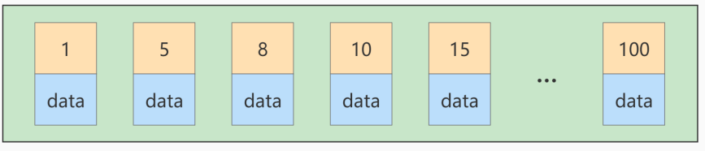
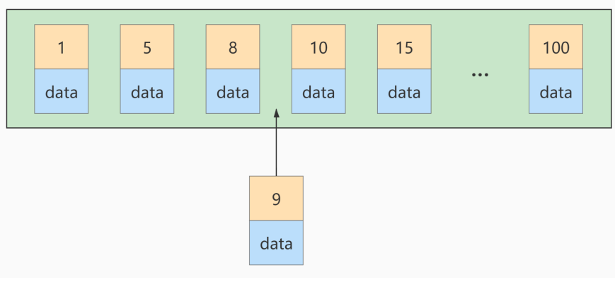
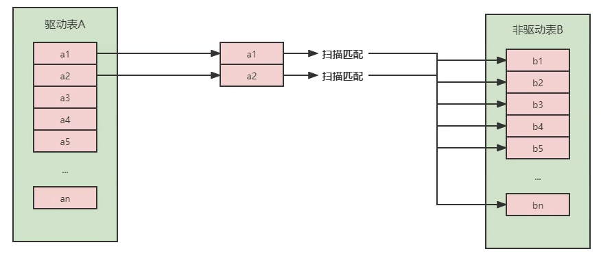
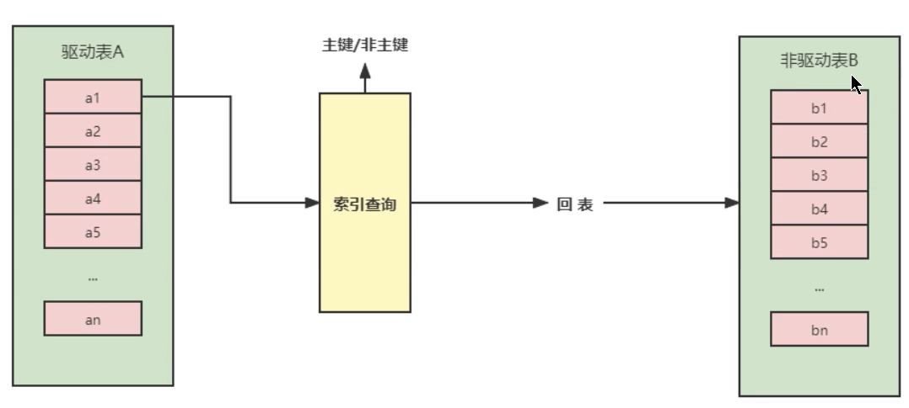
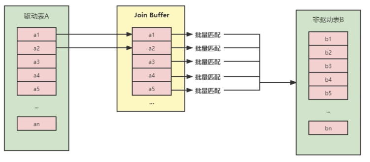

# 索引优化与查询

## 

都有哪些维度可以进行数据库调优?简言之:

+ 索引失效、没有充分利用到索引- -索引建立

+ 关联查询太多JOIN (设计缺陷或不得已的需求) - - -SQL优化

+ 服务器调优及各个参数设置(缓冲、 线程数等)-- 调整my.cnf

+ 数据过多-- -分库分表

	关于数据库调优的知识点非常分散。不同的DBMS,不同的公司，不同的职位，不同的项目遇到的问题都不尽相司。这里我们分为三个章节进行细致讲解。
	
	虽然SQL查询优化的技术有很多,但是大方向上完全可以分成==物理查询优化==和==逻辑查询优化==两大块。
	
	+ 物理查询优化是通过索引和表连接方式等技术来进行优化，这里重点需要掌握索引|的使用。
	+ 逻辑查询优化就是通过SQL等价变换提升查询效率,直白一-点就是说，换- -种查询写法执行效率可能更高。


## 1、数据准备

学员表 插 50万 条， 班级表 插 1万 条。

```mysql
CREATE TABLE `class` (
`id` INT(11) NOT NULL AUTO_INCREMENT,
`className` VARCHAR(30) DEFAULT NULL,
`address` VARCHAR(40) DEFAULT NULL,
`monitor` INT NULL ,
PRIMARY KEY (`id`)
) ENGINE=INNODB AUTO_INCREMENT=1 DEFAULT CHARSET=utf8;
CREATE TABLE `student` (
`id` INT(11) NOT NULL AUTO_INCREMENT,
`stuno` INT NOT NULL ,
`name` VARCHAR(20) DEFAULT NULL,
`age` INT(3) DEFAULT NULL,
`classId` INT(11) DEFAULT NULL,
PRIMARY KEY (`id`)
#CONSTRAINT `fk_class_id` FOREIGN KEY (`classId`) REFERENCES `t_class` (`id`)
) ENGINE=INNODB AUTO_INCREMENT=1 DEFAULT CHARSET=utf8;
```

```mysql
#随机产生字符串
DELIMITER //
CREATE FUNCTION rand_string(n INT) RETURNS VARCHAR(255)
BEGIN
DECLARE chars_str VARCHAR(100) DEFAULT
'abcdefghijklmnopqrstuvwxyzABCDEFJHIJKLMNOPQRSTUVWXYZ';
DECLARE return_str VARCHAR(255) DEFAULT '';
DECLARE i INT DEFAULT 0;
WHILE i < n DO
SET return_str =CONCAT(return_str,SUBSTRING(chars_str,FLOOR(1+RAND()*52),1));
SET i = i + 1;
END WHILE;
RETURN return_str;
END //
DELIMITER ;
#假如要删除
#drop function rand_string;

```

```mysql
#用于随机产生多少到多少的编号
DELIMITER //
CREATE FUNCTION rand_num (from_num INT ,to_num INT) RETURNS INT(11)
BEGIN
DECLARE i INT DEFAULT 0;
SET i = FLOOR(from_num +RAND()*(to_num - from_num+1)) ;
RETURN i;
END //
DELIMITER ;
#假如要删除
#drop function rand_num;
```

```mysql
#创建往stu表中插入数据的存储过程
DELIMITER //
CREATE PROCEDURE insert_stu( START INT , max_num INT )
BEGIN
DECLARE i INT DEFAULT 0;
SET autocommit = 0; #设置手动提交事务
REPEAT #循环
SET i = i + 1; #赋值
INSERT INTO student (stuno, name ,age ,classId ) VALUES
((START+i),rand_string(6),rand_num(1,50),rand_num(1,1000));
UNTIL i = max_num
END REPEAT;
COMMIT; #提交事务
END //
DELIMITER ;
#假如要删除
#drop PROCEDURE insert_stu;
```

```mysql
#执行存储过程，往class表添加随机数据
DELIMITER //
CREATE PROCEDURE `insert_class`( max_num INT )
BEGIN
DECLARE i INT DEFAULT 0;
SET autocommit = 0;
REPEAT
SET i = i + 1;
INSERT INTO class ( classname,address,monitor ) VALUES
(rand_string(8),rand_string(10),rand_num(1,100000));
UNTIL i = max_num
END REPEAT;
COMMIT;
END //
DELIMITER ;
#假如要删除
#drop PROCEDURE insert_class;

```

```mysql
#执行存储过程，往class表添加1万条数据
CALL insert_class(10000);
```

```mysql
#执行存储过程，往stu表添加50万条数据
CALL insert_stu(100000,500000);
```

删除表上的索引

```mysql
DELIMITER //
CREATE PROCEDURE `proc_drop_index`(dbname VARCHAR(200),tablename VARCHAR(200))
BEGIN
DECLARE done INT DEFAULT 0;
DECLARE ct INT DEFAULT 0;
DECLARE _index VARCHAR(200) DEFAULT '';
DECLARE _cur CURSOR FOR SELECT index_name FROM
information_schema.STATISTICS WHERE table_schema=dbname AND table_name=tablename AND
seq_in_index=1 AND index_name <>'PRIMARY' ;
#每个游标必须使用不同的declare continue handler for not found set done=1来控制游标的结束
DECLARE CONTINUE HANDLER FOR NOT FOUND set done=2 ;
#若没有数据返回,程序继续,并将变量done设为2
OPEN _cur;
FETCH _cur INTO _index;
WHILE _index<>'' DO
SET @str = CONCAT("drop index " , _index , " on " , tablename );
PREPARE sql_str FROM @str ;
EXECUTE sql_str;
DEALLOCATE PREPARE sql_str;
SET _index='';
FETCH _cur INTO _index;
END WHILE;
CLOSE _cur;
END //
DELIMITER ;
```

```mysql
CALL proc_drop_index("dbname","tablename");
```

## 2、索引失效案例

MySQL中==提高性能==的一个最有效的方式是对数据表==设计合理的索引==。索弓|提供了高效访问数据的方法,并且加快查询的速度，因此索引对查询的速度有着至关重要的影响。

+ 使用索引可以==快速地定位==表中的某条记录，从而提高数据库查询的速度,提高数据库的性能。
+ 如果查询时没有使用索引，查询语句就会==扫描表中的所有记录==。在数据量大的情况下，这样查询的速度会很慢。

大多数情况下都(默认)采用==B+树==来构建索引。只是空间列类型的索引使用==R-树==，并且MEMORY表还支持==hash索引==。其实，用不用索引，最终都是优化器说了算。优化器是基于什么的优化器?基于==cost开(CostBase0ptimizer)==，它不是基于规则==(Rule- Basedoptimizer)==，也不是基于==语义==。怎么样开销小就怎么来。另外，==SOL语句是否使用索引，跟数据库版本、数据量、数据选择度都有关系==。


### 2.1 全值匹配我最爱

```mysql
#创建索引前后
EXPLAIN SELECT SQL_NO_CACHE * FROM student WHERE age =30;
EXPLAIN SELECT SQL_NO_CACHE * FROM student WHERE age =30 AND classId=4;
EXPLAIN SELECT SQL_NO_CACHE * FROM student WHERE age =30 AND classId=4 AND NAME='AJFiXp';
```


```mysql
CREATE INDEX idx_age ON student(age);
CREATE INDEX idx_age_classid ON student(age,classId);
CREATE INDEX idx_age_classid_name ON student(age,classId,NAME);
```


### 2.2 最佳左前缀法则


### 2.3主键插入顺序



如果此时再插入一条主键值为 9 的记录，那它插入的位置就如下图：



可这个数据页已经满了，再插进来咋办呢？我们需要把当前==页面分裂==成两个页面，把本页中的一些记录 移动到新创建的这个页中。页面分裂和记录移位意味着什么？意味着： ==性能损耗== ！所以如果我们想尽量 避免这样无谓的性能损耗，最好让插入的记录的 ==主键值依次递增== ，这样就不会发生这样的性能损耗了。 所以我们建议：让主键具有 ==AUTO_INCREMENT== ，让存储引擎自己为表生成主键，而不是我们手动插入。


### 2.4 计算、函数、类型转换(自动或手动)导致索引失效

#### 举例一、

**失效**

```mysql
#创建索引
CREATE INDEX idx_name ON student(NAME);

EXPLAIN SELECT SQL_NO_CACHE * FROM student WHERE student.name LIKE 'abc%';
#索引失效
EXPLAIN SELECT SQL_NO_CACHE * FROM student WHERE LEFT(student.name,3) = 'abc';
```

#### 举例二、

```mysql
CREATE INDEX idx_sno ON student(stuno);
#索引失效
EXPLAIN SELECT SQL_NO_CACHE id, stuno, NAME FROM student WHERE stuno+1 = 900001;
```

**优化**

```mysql
EXPLAIN SELECT SQL_NO_CACHE id, stuno, NAME FROM student WHERE stuno = 900000;
```

#### 举例三、

```mysql
CREATE INDEX idx_name ON student(NAME);
#失效
EXPLAIN SELECT id, stuno, NAME FROM student WHERE SUBSTRING(NAME, 1,3)='abc';
```


### 2.5 类型转换导致索引失效

```mysql
# 未使用到索引
EXPLAIN SELECT SQL_NO_CACHE * FROM student WHERE name=123;
# 使用到索引
EXPLAIN SELECT SQL_NO_CACHE * FROM student WHERE name='123';
```


### 2.6 范围条件右边的列索引失效

```mysql
ALTER TABLE student DROP INDEX idx_name;
ALTER TABLE student DROP INDEX idx_age;
ALTER TABLE student DROP INDEX idx_age_classid;

EXPLAIN SELECT SQL_NO_CACHE * FROM student
WHERE student.age=30 AND student.classId>20 AND student.name = 'abc' ;


CREATE INDEX idx_age_classId_name ON student(age,classId,NAME);

EXPLAIN SELECT SQL_NO_CACHE * FROM student
WHERE student.age=30 AND student.classId>20 AND student.name = 'abc' ;#key_length=10  所以name没有被使用


CREATE INDEX idx_aged_name_classI ON student(age,NAME,classId);

EXPLAIN SELECT SQL_NO_CACHE * FROM student
WHERE student.age=30  AND student.name = 'abc' AND student.classId>20;

```

### 2.7不等于(!= 或者<>)索引失效

```mysql
EXPLAIN SELECT SQL_NO_CACHE * FROM student WHERE age !=1;
EXPLAIN SELECT SQL_NO_CACHE * FROM student WHERE age <>1;
```

### 2.8 is null可以使用索引，is not null无法使用索引

```mysql
CREATE INDEX idx_age ON student(age);
EXPLAIN SELECT SQL_NO_CACHE * FROM student WHERE age IS NOT NULL;
EXPLAIN SELECT SQL_NO_CACHE * FROM student WHERE age IS  NULL;
```

### 2.9 like以通配符%开头索引失效

```mysql
EXPLAIN SELECT SQL_NO_CACHE * FROM student WHERE NAME LIKE '%a';#严禁使用左模糊或者全模糊
```

### 2.10 OR 前后存在非索引的列，索引失效

```mysql
SHOW INDEX FROM student; #存在索引age

EXPLAIN SELECT SQL_NO_CACHE * FROM student WHERE age =1 OR NAME='aabgAi';
EXPLAIN SELECT SQL_NO_CACHE * FROM student WHERE  NAME='aabgAi' OR age = 1;

```


## 3、关联查询优化

### 1、内外连接

```mysql
CREATE TABLE `type`(
`id` INT(10) NOT NULL AUTO_INCREMENT,
`card` INT(10) NOT NULL,
PRIMARY KEY(`id`))

CREATE TABLE `book`(
`id` INT(10) NOT NULL AUTO_INCREMENT,
`card` INT(10) NOT NULL,
PRIMARY KEY(`id`)
)
INSERT INTO book(card) VALUES
(FLOOR(1+(RAND()*20))),(FLOOR(1+(RAND()*20))),(FLOOR(1+(RAND()*20))),(FLOOR(1+(RAND()*20))),
(FLOOR(1+(RAND()*20))),(FLOOR(1+(RAND()*20))),(FLOOR(1+(RAND()*20))),(FLOOR(1+(RAND()*20))),
(FLOOR(1+(RAND()*20))),(FLOOR(1+(RAND()*20))),(FLOOR(1+(RAND()*20))),(FLOOR(1+(RAND()*20))),
(FLOOR(1+(RAND()*20))),(FLOOR(1+(RAND()*20))),(FLOOR(1+(RAND()*20))),(FLOOR(1+(RAND()*20))),
(FLOOR(1+(RAND()*20))),(FLOOR(1+(RAND()*20))),(FLOOR(1+(RAND()*20))),(FLOOR(1+(RAND()*20)))
;
INSERT INTO `type`(card) VALUES
(FLOOR(1+(RAND()*20))),(FLOOR(1+(RAND()*20))),(FLOOR(1+(RAND()*20))),(FLOOR(1+(RAND()*20))),
(FLOOR(1+(RAND()*20))),(FLOOR(1+(RAND()*20))),(FLOOR(1+(RAND()*20))),(FLOOR(1+(RAND()*20))),
(FLOOR(1+(RAND()*20))),(FLOOR(1+(RAND()*20))),(FLOOR(1+(RAND()*20))),(FLOOR(1+(RAND()*20))),
(FLOOR(1+(RAND()*20))),(FLOOR(1+(RAND()*20))),(FLOOR(1+(RAND()*20))),(FLOOR(1+(RAND()*20))),
(FLOOR(1+(RAND()*20))),(FLOOR(1+(RAND()*20))),(FLOOR(1+(RAND()*20))),(FLOOR(1+(RAND()*20)))
;
```


```mysql
EXPLAIN SELECT SQL_NO_CACHE * FROM `type` LEFT JOIN book ON type.card = book.card;#全表扫描

ALTER TABLE book ADD INDEX Y ( card);#被驱动表增加索引

EXPLAIN SELECT SQL_NO_CACHE * FROM `type` LEFT JOIN book ON type.card = book.card;

ALTER TABLE `type` ADD INDEX X ( card);#驱动表增加索引

EXPLAIN SELECT SQL_NO_CACHE * FROM `type` LEFT JOIN book ON type.card = book.card;

CALL proc_drop_index('atguigudb1','book')

EXPLAIN SELECT SQL_NO_CACHE * FROM `type` LEFT JOIN book ON type.card = book.card;

CALL proc_drop_index('atguigudb1','type')


EXPLAIN SELECT SQL_NO_CACHE * FROM `type` INNER JOIN book ON type.card = book.card;

ALTER TABLE book ADD INDEX Y ( card);

EXPLAIN SELECT SQL_NO_CACHE * FROM `type` INNER JOIN book ON type.card = book.card;

ALTER TABLE `type` ADD INDEX X ( card);

EXPLAIN SELECT SQL_NO_CACHE * FROM `type` INNER JOIN book ON type.card = book.card;
#对于内连接，查询优化器自己决定哪张表作为驱动表，哪张表所谓被驱动表，如果两张表的连接条件字段只能有一个索引，最好是加在被驱动表上

ALTER TABLE `type` ADD INDEX X ( card);
ALTER TABLE book ADD INDEX Y ( card);
EXPLAIN SELECT SQL_NO_CACHE * FROM `type` INNER JOIN book ON type.card = book.card;

id	select_type	table	partitions	type	possible_keys	key	key_len	ref	rows	filtered	Extra
1	SIMPLE	book	\N	index	Y	Y	4	\N	20	100.00	Using index
1	SIMPLE	type	\N	ref	X	X	4	atguigudb1.book.card	2	100.00	Using index

#若book作为驱动表  向book表再加20条数据
INSERT INTO `book`(card) VALUES
(FLOOR(1+(RAND()*20))),(FLOOR(1+(RAND()*20))),(FLOOR(1+(RAND()*20))),(FLOOR(1+(RAND()*20))),
(FLOOR(1+(RAND()*20))),(FLOOR(1+(RAND()*20))),(FLOOR(1+(RAND()*20))),(FLOOR(1+(RAND()*20))),
(FLOOR(1+(RAND()*20))),(FLOOR(1+(RAND()*20))),(FLOOR(1+(RAND()*20))),(FLOOR(1+(RAND()*20))),
(FLOOR(1+(RAND()*20))),(FLOOR(1+(RAND()*20))),(FLOOR(1+(RAND()*20))),(FLOOR(1+(RAND()*20))),
(FLOOR(1+(RAND()*20))),(FLOOR(1+(RAND()*20))),(FLOOR(1+(RAND()*20))),(FLOOR(1+(RAND()*20)))
;
EXPLAIN SELECT SQL_NO_CACHE * FROM `type` INNER JOIN book ON type.card = book.card;
#对于内连接来说，如果连接条件上都有索引 会选择数据量小的表作为驱动表
id	select_type	table	partitions	type	possible_keys	key	key_len	ref	rows	filtered	Extra
1	SIMPLE	type	\N	index	X	X	4	\N	20	100.00	Using index
1	SIMPLE	book	\N	ref	Y	Y	4	atguigudb1.type.card	1	100.00	Using index
```

### 2、join语句的原理

> join方式连接多个表，本质就是各个表之间数据的循环匹配。MySQL5.5 版本之前，MySQL只支持-种表间关联方
> 式，就是嵌套循环(Nested Loop Join)。如果关联表的数据量很大，则join关联的执行时间会非常长。在MySQL5.5
> 以后的版本中，MySQL通过引入BNLJ算法来优化嵌套执行。


根据执行计划的结果，在上面的表就是驱动表，下面的标识被驱动表

准备数据

```mysql

CREATE TABLE a(f1 INT,f2 INT ,INDEX(f1));
CREATE TABLE b(f1 INT,f2 INT );

CALL proc_drop_index('atguigudb1','b')

INSERT INTO a VALUES(1,1),(2,2),(3,3),(4,4),(5,5),(6,6);
INSERT INTO b VALUES(3,3),(4,4),(5,5),(6,6),(7,7),(8,8);

#对于外连接来说 前面的不一定是驱动表 
EXPLAIN SELECT *FROM a LEFT JOIN b ON a.f1 = b.f1 WHERE a.f2 = b.f2;

EXPLAIN SELECT *FROM a LEFT JOIN b ON a.f1 = b.f1 AND a.f2 = b.f2;
```


#### 1、Simple Nested-Loop Join (简单嵌套循环连接)



可以看到这种方式效率是非常低的，以上述表A数据100条,表B数据1000条计算, 则A*B = 10万次。开销统计如下

| 开销统计     | SNLJ  |
| ------------ | ----- |
| 外表扫描次数 | 1     |
| 内表扫描次数 | A     |
| 读取记录数   | A+B*A |
| JOIN比较次数 | B*A   |
| 回表读取次数 | 0     |


#### 2、 Index Nested-Loop Join (索引嵌套循环连接)

> Index Nested-Loop Join其优化的思路主要是为了==减少内层表数据的匹配次数==，所以要求==被驱动表上必须有索引才
> 行==。通过外层表匹配条件直接与内层表索引进行匹配，避免和内层表的每条记录去进行比较，这样极大的减少 了对内层表的匹配次数。



驱动表中的每条记录通过被驱动表的索引|进行访问，因为索引查询的成本是比较固定的,故mysql优化器都倾向于使用记录数少的表作为驱动表(外表)。

**主要区别：不用扫描全表 直接找索引**

| 开销统计     | SNLJ  | INLJ                       |
| ------------ | ----- | -------------------------- |
| 外表扫描次数 | 1     | 1                          |
| 内表扫描次数 | A     | 0                          |
| 读取记录数   | A+B*A | A+B(match)                 |
| JOIN比较次数 | B*A   | A*Index(Height) 索引高度   |
| 回表读取次数 | 0     | B(match)(if possible) 回表 |

如果被驱动表加索引，效率是非常高的，但如果索引不是主键索引，所以还得进行一次回表查询。相比，被驱动表的索引是主键索引，效率会更高。


#### 3、Block Nested-Loop Join (块嵌套循环连接)

如果存在索引，那么会使用index的方式进行join, 如果join的列没有索引，被驱动表要扫描的次数太多了。每次访问被驱动表，其表中的记录都会被加载到内存中,然后再从驱动表中取一条与其匹配，匹配结束后清除内存，然后再从驱动表中加载一条记录， 然后把被驱动表的记录在加载到内存匹配，这样周而复始，大大增加了IO的次数。为了减少被驱动表的IO次数,就出现了Block Nested-oop Join的方式。不再是逐条获取驱动表的数据，而是一块-块的获取，引入了==join buffer缓冲区==，将驱动表join相关的部分数据列(大小受join buffer的限制缓存到join buffer中,然后全表扫描被驱动表,==被驱动表的每一条记录一 次性和join buffer中的所有驱动表记录进行匹配(内存中操作)，将简单嵌套循环中的多次比较合并成一次, 降低了被驱动表的访问频率==。		

> 注意:
> 这里缓存的不只是关联表的列，select 后面的列也会缓存起来。在一个有N个join关联的sq|中会分配N-1个join buffer. 所以查询的时候尽量减少不必要的字段，可以让join buffer中可以存放更多的列。




| 开销统计     | SNLJ  | INLJ                       | BNLJ                                               |
| :----------- | ----- | -------------------------- | -------------------------------------------------- |
| 外表扫描次数 | 1     | 1                          | 1                                                  |
| 内表扫描次数 | A     | 0                          | A* used_ column_size / join_ buffer size+1         |
| 读取记录数   | A+B*A | A+B(match)                 | A+B * (A* used_ column_ size / join_ buffer_ size) |
| JOIN比较次数 | B*A   | A*Index(Height) 索引高度   | B*A                                                |
| 回表读取次数 | 0     | B(match)(if possible) 回表 | 0                                                  |

参数设置：

+ block_nested_loop

​	通过==SHOW VARIABLES LIKE '%optimizer_switch%';== 查看==block_nested_loop==的状态

+ join_buffer_size

​	驱动表能不能一次加载完, 要看join buffer能不能存储所有的数据，默认情况下==join_buffer_size=256k==

​	

join_buffer_size的最大值在32位系统可以申请4G，而在64位操做系统下可以申请大于4G的Join Buffer空间(64 位
Windows除外，其大值会被截断为4GB并发出警告)


#### 4、join总结

+ 整体效率比较: INLJ> BNLJ> SNLJ

+ 永远用小结果集驱动大结果集(其本质就是减少外层循环的数据数量) (小的度量单位指的是表行数*每行大小）

  ```mysql
  #straight_join 强制前表左表为驱动表 t1.b只查一个字段 t2.*查询所有字段 按照join buffer逻辑,能放更多的t1结果集，减少t1表的IO次数
  select t1.b,t2.* from t1 straight_join t2 on (t1.b=t2.b) where t2. id<=100; #推荐
  select t1.b,t2.* from t2 straight_join t1 on (t1.b=t2.b) where t2. id<=100; #不推荐
  ```

+ 为被驱动表匹配的条件增加索引减少内层表的循环匹配次数)

+ 增大join buffer size的大小(- 次缓存的数据越多，那么内层包的扫表次数就越少)

+ 减少驱动表不必要的字段查询(字段越少, join buffer所缓存的数据就越多)

#### 5、HASH JOIN

从MySQL的8.0.20版本开始将废弃BNLJ,因为从MySQL8.0.18版本开始就加入了hash join默认都会使用hash join

+ Nested Loop:

  对于被连接的数据子集较小的情况，Nested Loop是个较好的选择。

+ Hash Join是做==大数据集连接==时的常用方式，优化器使用两个表中较小(相对较小)的表利用Join Key在内存中
  建立==散列表==，然后扫描较大的表并探测散列表,找出与Hash表匹配的行。

  + 这种方式适用于较小的表完全可以放于内存中的情况，这样总成本就是访问两个表的成本之和。
  + 在表很大的情况下并不能完全放入内存,这时优化器会将它分割成==若干不同的分区==,不能放入内存的部分
    就把该分区写入磁盘的临时段，此时要求有较大的临时段从而尽量提高I/0的性能。
  + 它能够很好的工作于没有索引的大表和并行查询的环境中，并提供最好的性能。大多数人都说它是Join的
    重型升降机。Hash Join只能应用于等值连接(如WHERE A.COL1 = B.COL2),这是由Hash的特点决定的。


## 4、子查询优化

MySQL从4.1版本开始支持子查询，使用子查询可以进行SELECT语句的嵌套查询，即一个SELECT查询的结果作为另
一个SELECT语句的条件。子 查询可以一次性完成很 多逻辑上需要多个步骤才能完成的SQL操作。
